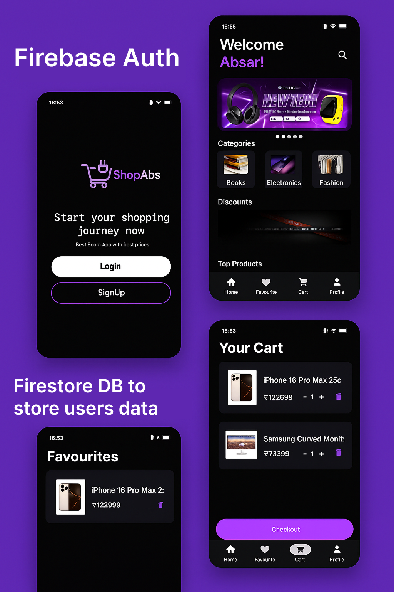
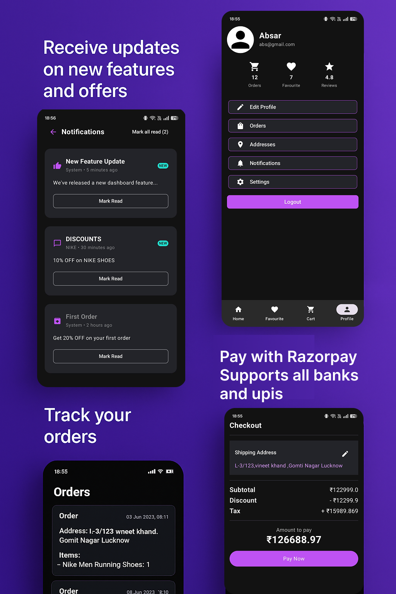
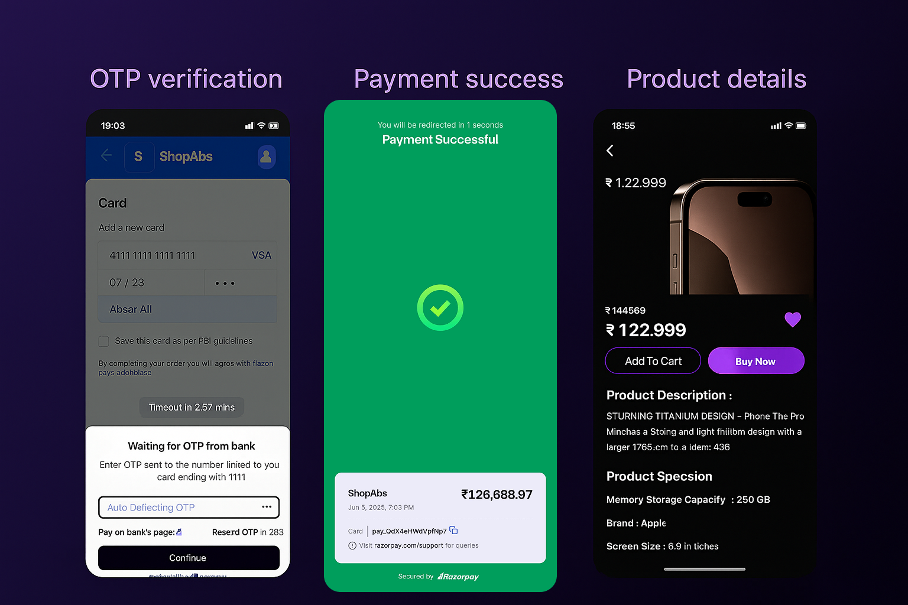

# Ecommerce App – Android Kotlin

A modern, full-featured Ecommerce Android application built with Kotlin, integrating Firebase for authentication and real-time data, and Razorpay for secure payments.

---

## 🚀 Features

- User authentication (Email/Password, Google, etc.)
- Real-time product catalog, cart, and order management
- Secure payments with Razorpay
- Admin panel for product and order management
- MVVM architecture for maintainable codebase

---

## 🖼️ Screenshots

<p align="center">
  
  <br/><sub><u>Firebase Auth and Real-time data</u></sub>
  <br/><br/><br/>
  
  <br/><sub><u>Track Orders using Firestore</u></sub>
  <br/><br/><br/>
  
  <br/><sub><u>Razorpay Integration for safe payment</u></sub>
  <br/><br/>
</p>


---

## 🔌 Integrations

### 1. Firebase

#### Authentication
- User registration and login via Firebase Authentication.
- Multiple providers (Email/Password, Google, etc.).
- Handles user session and profile management.

#### Realtime Database
- Stores products, categories, users, carts, and orders.
- Instant updates and synchronization of data across devices.
- Security rules to protect user and business data.

#### Cloud Storage (Optional)
- Stores product images and user profile pictures.
- Accessed securely via Firebase Storage rules.


**Setup Steps:**
1. Create a Firebase project in the [Firebase Console](https://console.firebase.google.com/).
2. Register your Android app and download the `google-services.json` file.
3. Place `google-services.json` in the `app/` directory.
4. Add Firebase SDK dependencies in your `build.gradle`:
    ```
    implementation platform('com.google.firebase:firebase-bom:33.14.0')
    implementation 'com.google.firebase:firebase-auth'
    implementation 'com.google.firebase:firebase-database'
    implementation 'com.google.firebase:firebase-storage'
    ```
5. Enable Authentication, Realtime Database, and Storage in the Firebase Console.
6. Configure security rules as needed.

---

### 2. Razorpay Payment Gateway

- Integrates Razorpay Android SDK for secure online payments.
- Supports UPI, cards, net banking, wallets.
- Handles payment success and failure, updating order status accordingly.

**Setup Steps:**
1. Register on Razorpay and obtain your API Key.
2. Add Razorpay SDK to your `build.gradle`:
    ```
    implementation 'com.razorpay:checkout:1.6.33'
    ```
3. Initialize Razorpay in your checkout activity:
    ```
    val checkout = Checkout()
    checkout.setKeyID("YOUR_KEY_ID")
    ```
4. Start payment with order details and handle callbacks:
    ```
    checkout.open(activity, options)
    ```
5. Update order status in Firebase upon payment completion.

---


## 📁 Project Structure

- `auth/` – Authentication logic and UI
- `data/` – Data models, repositories, and Firebase helpers
- `ui/` – Activities, Fragments, ViewModels
- `payments/` – Razorpay integration

---

## 🛠️ Getting Started

### Prerequisites
- Android Studio (latest version recommended)
- Kotlin 1.8+
- Firebase project
- Razorpay account

### Installation

1. **Clone the Repository**
    ```
    git clone https://github.com/Absar-ao4/Ecommerce-App.git
    cd Ecommerce-App
    ```

2. **Firebase Setup**
    - Follow the Firebase setup steps above.
    - Ensure all required services are enabled.

3. **Razorpay Setup**
    - Follow the Razorpay setup steps above.

4. **Build and Run**
    - Open the project in Android Studio.
    - Sync Gradle and run on an emulator or device.

---

## 🤝 Contribution

Contributions are welcome! Fork the repo and submit a pull request.

---

## 📄 License

This project is licensed under the MIT License.

---

## 🙏 Acknowledgements

- [Firebase](https://firebase.google.com/)
- [Razorpay](https://razorpay.com/)
- [Android Developers](https://developer.android.com/)

---

> For detailed integration steps, refer to the official documentation for [Firebase](https://firebase.google.com/docs/) and [Razorpay](https://razorpay.com/docs/).  
> Happy coding! 🚀
